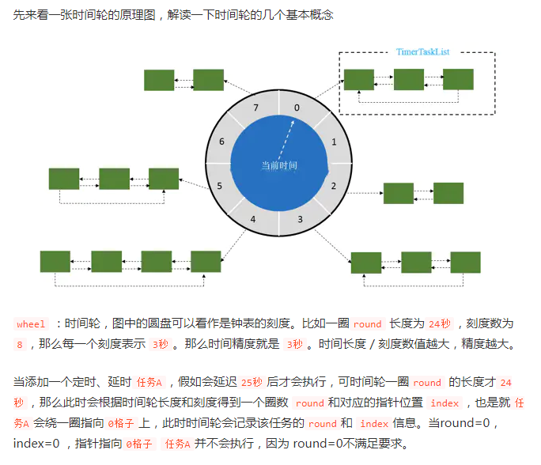

## 懒癌患者的学习笔记

#### 	前言：能力有限，所思所想不一定完全正确，欢迎大家指点

#### 延时队列的6种实现方式

​    1、使用JDK原生JUC下DelayQueue实现订单超时关闭的延时队列

- version 1.0：采用静态常量Map模拟数据库保存订单，spring容器管理延时队列DelayQueue
  - 超时时间：15s
  - 使用线程池，每次新增订单调用延时队列方法

​    2、使用quartz任务调度器（这里直接采用定时任务注解）

- version 1.0：使用本地缓存Map模拟数据库
  - @Scheduled(cron = "0/1 * * * * ?")  每秒执行一次的定时任务
  - @Scheduled(fixedDelay = 1000) 这个是当前任务完成后一秒再次执行 和 @Scheduled(cron = "0/1 * * * * ?")  + 线程sleep方法效果一致；
- version 1.0：使用数据库
  - 每次创建订单，添加订单到本地缓存中，再保存到数据库
  - 支付完成直接移除本地缓存中的订单，更新数据库中订单状态
  - @Scheduled(cron = "0/1 * * * * ?")  每秒执行一次的定时任务，定时检查延时的订单
  - @Scheduled(cron = "0/15 * * * * ?") 每隔15s执行一次查询数据库中，未支付并且延时时间小于当前时间的，逻辑删除
  - 前端展示未支付订单直接从缓存中获取，这样避免短时间数据库数据不一致问题
  - 关于OOM问题（待续）

​    3、使用Redis的ZSet实现延时队列

- 创建订单的时候，将订单保存到Redis。

  - ```java
    //第一个参数：整个ZSet的key
    //第二个参数：Set的key
    //第三个参数：当前这个Set的key的score分数
    //ZSet结构：{"key":{"Order唯一标识":PRESENT}, "Order唯一标识":PRESENT}} 每个Order唯一标识对应一个score
    this.redisTemplate.opsForZSet().add(AppConst.DELAY_QUEUE, "Order唯一标识", "Order的超时时间");
    ```

- 开启线程执行轮询Redis的延时队列的操作，获取队列中的订单唯一标识，判断当前订单的score如果小于当前时间毫秒值，移除Redis中的该订单，逻辑删除数据库中订单

- 支付完成，移除Redis延时队列中的订单

​    4、使用Redis超时回调实现延时队列

-  `Redis` 的`key`过期回调事件，也能达到延迟队列的效果，简单来说我们开启监听key是否过期的事件，一旦key过期会触发一个callback事件。 
  -  修改`redis.conf`文件开启`notify-keyspace-events Ex` 

​    5、时间轮

-  `kafka`、`netty`都有基于时间轮算法实现延时队列，这里只采用了Netty的 HashedWheelTimer 实现
-  保存订单之后开启线程执行时间轮方法，超时逻辑删除数据库中的订单
- 

​    6、RabbitMQ延时队列

- 订单支付成功，将订单编号发送到TTL队列。
- TTL中的消息无论是否支付成功，延时都是进入死信队列
- 监听死信队列的方法需要进行判断，当前订单是否支付成功，未支付成功进行关单操作
- 支付成功，将订单编号发送到支付成功的队列，进而监听队列方法进行消费
